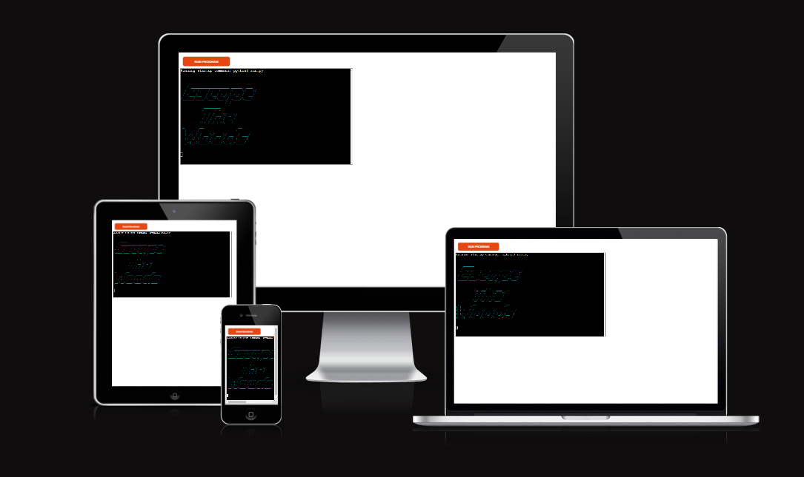

# Escape The Woods

Link to [Deployed App](https://escape-the-wood-d0f5272a8865.herokuapp.com/)

## Background to Escape the Woods
Escape the Woods is a [Python](https://www.python.org/) terminal application which is an homage to old-school, text-based adventure games.
Text-based adventure games like [Zork](https://en.wikipedia.org/wiki/Zork) were among the first interactive media accessible on computers. Given that they only require user input, they lend themselves perfectly to input validation.

## How to Play

1. Click [here](https://escape-the-wood-d0f5272a8865.herokuapp.com/) to access the app
2. The app will begin automatically.
3. Read the introduction carefully 
4. Input your name
5. Read the description and input at least 3 letters of your chosen action
6. Visit areas, collect items, read descriptions and survive
7. Know that some areas require items to progress
8. To 'win' you must visit all rooms and defeat both enemies
9. Encounters with enemies require specific items(weapons)
10. Engaging in an encounter without a weapon will end in defeat
11. Restart the game
12. Become frustrated, like the good old days

You can find a guide below on exact steps to take to win

---
## User Stories
### First-time Users
 - As a first-time user, I want to understand how to interact with the app
 - As a first-time user, I want clear objectives
 - As a firt-time user, I want the app to anticipate my inputs and work regardless of what I type

 ### Returning Users
 - As a returning user, I want to be able to finish the game in an efficient way
 - As a returning user, I want to be able to take different routes

---

 ## Features
 
