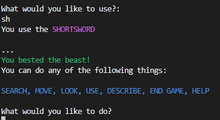
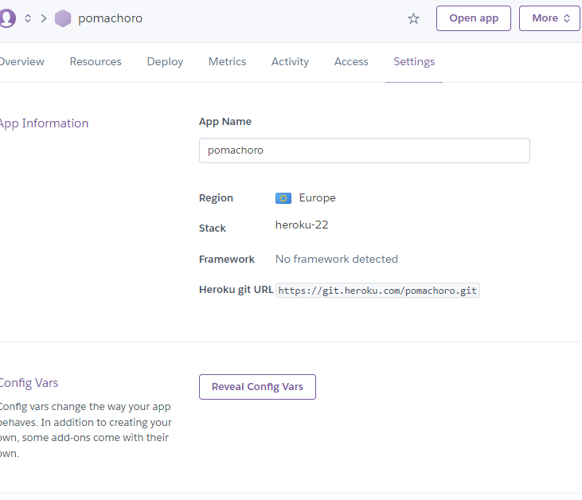

# Escape The Woods


Link to [Deployed App](https://escape-the-wood-d0f5272a8865.herokuapp.com/)

## Background to Escape the Woods
Escape the Woods is a [Python](https://www.python.org/) terminal application which is an homage to old-school, text-based adventure games.
Text-based adventure games like [Zork](https://en.wikipedia.org/wiki/Zork) were among the first interactive media accessible on computers. Given that they only require user input, they lend themselves perfectly to input validation.

## How to Play

1. Click [here](https://escape-the-wood-d0f5272a8865.herokuapp.com/) to access the app
2. The app will begin automatically.
3. Read the introduction carefully 
4. Input your name
5. Read the description and input at least 3 letters of your chosen action
6. Visit areas, collect items, read descriptions and survive
7. Know that some areas require items to progress
8. To 'win' you must visit all rooms and defeat both enemies
9. Encounters with enemies require specific items(weapons)
10. Engaging in an encounter without a weapon will end in defeat
11. Restart the game
12. Become frustrated, like the good old days

You can find a guide below on exact steps to take to win

---
## User Stories
### First-time Users
 - As a first-time user, I want to understand how to interact with the app
 - As a first-time user, I want clear objectives
 - As a firt-time user, I want the app to anticipate my inputs and work regardless of what I type

 ### Returning Users
 - As a returning user, I want to be able to finish the game in an efficient way
 - As a returning user, I want to be able to take different routes

---

 ## Features
 
- ASCII logo during the intro

[Ascii Art](https://en.wikipedia.org/wiki/ASCII_art) uses strings of characters and special characters to create images and can be printed to consoles relatively easily.


- **Introduction**

    The introduction gives the user the goal of the game and incentivises paying careful attention to the descriptions of places and items. It also forewarns the player that they should be wary of encounters if they do not have the correct gear.


- **Prompt to enter a name and first room description**

    As seen above, after the introduction, the user is then prompted to enter a name, the input is validated and a welcome message is printed. The user is then itroduced to the world, in the first room.


- **Colors**

    Using the [colorama library](https://pypi.org/project/colorama/), color is added to certain texts. This is to create a better user experience and highlight key actions the user can take


- **Action functions**

    Throuout the game, the user is promted to input an action verb to trigger an action; "search", "move", "look", "use", "describe", "end game", and "help" all correspond to an in-game method. How the inputs are checked allows users to input only a partial string, e.g., "he" to run the help method.


- **Event and Encounter System**

    When the user enters certain rooms they will trigger events or encounters. They will be prompted to use an item. If they choose the correct item they will pass the event, choosing the wrong item causes a fail. However, in an encounter, failure means death.

    - **Event**
    ---

    

    - **Event Sucess**
    ---

    

    - **Event Fail**
    ---

    

    - **Encounter System**
    ---
    

    - **Encounter Success**
    ---
    

    - **Encounter Fail**
    ---
    
    

---
## Flowcharts

The logic of the game is a loop. While the player is "alive" they are continually prompted to input actions until certain game conditions are met.

- Initial chart with no encouter system


- Flowchart with encounter system


---

## Technologies

### Languages

- [Python 3.11.3](https://www.python.org/downloads/release/python-3113/): Used as the foundation for logic of the app (80.2%)

- [HTML](https://www.w3schools.com/html/html_intro.asp): Part of the CI Template, used to format the host webpage

- [Javascript](https://www.w3schools.com/js/): Also part of the CI template, used for webpage logic

### Libraries and Tools

#### Native Python Library Imports

- [random](https://docs.python.org/3/library/random.html): used to randomise item locations in rooms

- [time](https://docs.python.org/3/library/time.html): used to import the [sleep](https://docs.python.org/3/library/time.html#time.sleep) method to wait x number of seconds at certain points

- [sys](https://docs.python.org/3/library/sys.html): used to create a typing effect using the [sys.stdout](https://docs.python.org/3/library/sys.html#sys.stdout).write() method in conjunction with the sleep method above, and the sys.stdout.flush() method to clear the stdout buffer.

- [os](https://docs.python.org/3/library/os.html): used [os.system](https://docs.python.org/3/library/os.html#os.system) to prevent user input during typing effect, and used [os.name](https://docs.python.org/3/library/os.html#os.name) to clear the terminal regardless of current operating system.

#### Third Party Imports

- [colorama](https://pypi.org/project/colorama/): used to import Fore to change the color of terminal output.

#### Other Tools:

- [VSCode](https://code.visualstudio.com/) IDE and code editor used to write code
- [Git](https://git-scm.com/) was used for version control
- [GitHub](https://github.com/) was used to store the code to a cloud repository
- [GIMP](https://www.gimp.org/) was used to trim and alter PNGs used in documentation
- [Lucidchart](https://www.lucidchart.com/) was used to create flowcharts
- [Heroku](https://signup.heroku.com/) was used to deploy the terminal app online

--- 

## Bugs and Fixes

+ **Input Validation**:
    1. Player could input special characters
        - Fix: 
            ```python
            for char in input:
                    ...
                    elif not char.isalnum():
                        raise TypeError
                return True
            ```
    1. Player could leave blank input
        - Fix:
            ```python
            elif not bool(input):
                raise ValueError
            ```
    1. Player could not use spaces
        - Fix:
            ```python
            else:
                for char in input:
                    if char.isspace() and not input.isspace():
                        continue
            ```
    1.  Name containing spaces would not capitalize after space
        - Fix:
            ```python
            else:
            ...
            # .title() capitalizes letters after spaces
            print(f"Hello, {player_name.title()}. Your journey begins in:\n")
            ```
---

+ **Encounter and Event system**:
    
1. If user failed input validation during the use_item method within a triggered event or encounter, or if they wrote a non-existent item, the method was called again. However, if the user then input the correct item, a None value was returned, causing the user to lose the encounter, thus losing the game.

    ```python
    if self.validate_input(
                ...) is False:
                # Returning method to ensure an object is returned
                self.use_item(self.inventory)
        ...
        # If the item doesn't exist
        if chosen_item not in self.inventory:
            print("You haven't got that.")
            self.use_item(self.inventory)
    ```

    - **Fix**: rather than calling the method again, returned the method. I believe that due to each method being called within a while loop, simply calling them a second time, caused them to stack. Returning broke the previous iteration before calling the next

        ```python
        if self.validate_input(
                ...) is False:
                # Returning method to ensure an object is returned
            return self.use_item(self.inventory)
        ...
        # If the item doesn't exist
        if chosen_item not in self.inventory:
            print("You haven't got that.")
            return self.use_item(self.inventory)

        ```
1. If the user failed to open the chest in the village, the user could still search the chest after the event was triggered. This also meant that there was still an event in the room, so re-entering the room would trigger it again.

    - **Fix**: Simply change the search method to include a check that the room does not have an event.
      
        ```python
        def search(self, room):
            ...

            if (player_choice == item_location
                    and room.item_found is False and not room.has_event):
                # Setting the item_found to True for this room
                room.item_found = True
        ``` 

1. If user failed an event once, could not simply use item again on the room to pass the event. Would have to leave the room and re-enter to trigger the event

    - **Fix**: Add a check to use_item method to see if current_room is the Village or the Cottage. If so, the use_item method will check if the correct item was used and set the room.has_event to false.
        
        ```python
        def use_item(self, inventory):
            ...
            if ((current_room.name == "The Village"
                         or current_room.name == "The Cottage") and
                            (chosen_item ==
                                current_room.required_item.upper())):
                            sleep(2)
                            print(
                            ...
                            )
                            current_room.has_event = False
        ```

---

+ **Inventory Length**

    If user collected the majority of the items, look and use_item methods would print the inventory and spill over the console length.
    

    - **Fix**: Add a check to see if the inventory has a length of over five items. If it does, print the inventory over two lines.
        
        ```python
        if len(inventory) < 5:
                # Print full inventory
                print(*inventory, sep=", ")
            else:
                # Print inventory over two lines
                print(*inventory[0:5], sep=", ")
                print(*inventory[5:], sep=", ")
        ```
        

---

+ **Restarting the Game**

    1. The player would have their inventory from the previous game
        - **Fix:** Create an initialize_game function in the game_environment srcipt which initialized a new player, rather than referncing the previously instantiated current_player in player.py script.
            ```python
            def initialize_game():
                ...
                 # Inititalizing the player with default settings
                current_player = player.Player(
                "",
                [],
                map.generate_room_from_name("The Cottage")
                )
            ```
    1. The Rooms would be in the same state as the end of the previous game i.e, no events, no items

        - **Fix:** Create two new sets of rooms and an initialize_all_rooms function which reset room states.
        ```python
        # A set of rooms with encounters
        rooms_with_encounters = {
        river, dark_woods
        }

        # A set of rooms with events
        rooms_with_events = {
            river, village
        }

        ...

        def initialize_all_rooms():
        """
        Function which initializes all rooms so that if the
        user chooses to play again, everything will reset.
        """
        for room in all_rooms:
            room.has_been_visited = False
            room.item_found = False
            if room in rooms_with_encounters:
                room.has_encounter = True
            if room in rooms_with_events:
                room.has_event = True
        ```

    1. The while loop from the previous game was still active
    

    

    - **Fix:** Previously, when the player.alive was set to False, the player.register_inputs() method would call game_environment.restart_game(). Now, the metod simply returns, ending the loop, and the restart_game() function is called last in the initialize_game() function.
            
        ```python
        def initialize_game():
            ...
            current_player.register_user_inputs()
            # Finally, calls the restart_game funtion when loop ends
            restart_game()
        ```

+ **User Input Overwriting Typing**

    If the user mashed the keys while a description was typed, their inputs would overwrite what was being typed and create nonsense strings

    

    - **Fix:**
        ```python
        # Turn off user inputs
        os.system("stty -echo")
            for char in description:
                sleep(0.02)
                sys.stdout.write(Fore.WHITE + char)
                sys.stdout.flush()
            # Turn on user inputs
            os.system("stty echo")
        ```
---

## Valdation and Testing

Using [Code Institute](https://codeinstitute.net/)'s [Python linter](https://pep8ci.herokuapp.com/), I validated each script in accordance with [PEP8](https://peps.python.org/pep-0008/) guidelines

### run.py


### game_environment.py


This script contains ASCII art which flagged the linter for invalid escape sequences.

### item.py


### map.py


### player.py


### room.py


---

## Deployment

This app was deployed to [Heroku](https://signup.heroku.com/) and can be accessed [here](https://escape-the-wood-d0f5272a8865.herokuapp.com/)

1. Use the [Code Institute](https://codeinstitute.net/) portfolio project 3 [template](https://github.com/Code-Institute-Org/p3-template) to create a new repository.

    

2. Name the repostiory

    

3. Clone repository to IDE

    
    ---

    
    ---

4. Write your code

5. When you're ready for first deployment, navigate to [Heroku](https://signup.heroku.com/) and sign-up for an account

6. Once you have your account set up, from your dashboard, click "New" and then "Create new app"

    

7. Name your app and choose your region. Note: app name must be unique

    

8. Naviagte to settings

    

9. Add Config Vars. *Note:* PORT 8000 is required for CI template

    

10. Add buildpacks. *Note:* Python should be first, then NodeJS

    

11. Navigate to Deploy Tab

    

12. Connect to GitHub and repository

    

13. Enable automatic deployment

    

14. Open the app

    

---

## Credits

- [Moving from room to room](https://gamedev.stackexchange.com/questions/143523/movement-in-a-text-based-game-using-room-class-python)
- [Clearing the screen](https://www.geeksforgeeks.org/clear-screen-python/)
- [Typing effect](https://stackoverflow.com/questions/20302331/typing-effect-in-python)
- [Stopping user input](https://stackoverflow.com/questions/40973391/how-to-prevent-shell-from-getting-input-keyboard-while-running-a-python-script)

---

## Acknowlegments

[Iuliia Konovalova](https://github.com/IuliiaKonovalova) For trusting in my ability and guiding me well.

My brother, Aonghus, who play tested and broke my game many times.
